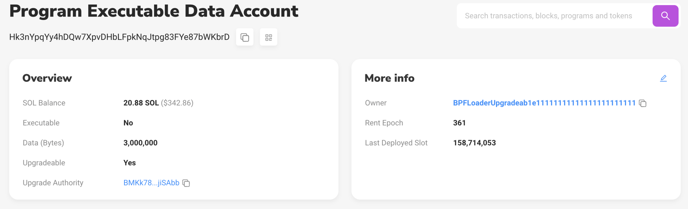

# Programs

Solana程序，在其他区块链上通常被称为“智能合约”，是区块链上每个交易解析发送的指令的可执行代码。

它们可以作为本地程序直接部署到网络核心，也可以由任何人作为链上程序发布。

程序分为两类，一类是普通程序一类是系统程序，前者在Solana中称为"On Chain Program" 后者称为"Native Program" 其实本质都是类似其他公链上所说的合约。

任何开发人员都可以编写和部署程序到Solana区块链。程序是链上活动的基础，为从DeFi和NFT到社交媒体和游戏的任何活动提供动力。

* 程序处理来自用户和其他程序的指令
* 所有的程序都是无状态的:它们与之交互的任何数据都存储在单独的帐户(Data Account)中，这些帐户通过指令传入
* 程序本身存储在标记为 `executable` 的帐户中
* 所有程序都归[BPF](https://docs.solana.com/developing/runtime-facilities/programs#bpf-loader)程序所有,并且运行在[Solana Runtime](https://docs.solana.com/developing/programming-model/runtime)中
* 所有程序都有一个单一的入口点，在那里进行指令处理(即 process_instruction );参数总是包括：
  * program_id: pubkey
  * accounts: array,
  * instruction_data: byte array

## Native Programs & The Solana Program Library (SPL)

Solana配备了许多程序，作为链上交互的核心。这些程序分为原生程序和Solana程序库(SPL)。

### Native Programs

Native Programs提供了操作/验证所需的基本功能。在这些程序中，最著名的是系统程序(system program)，它负责管理新帐户和在账户之间转移SOL。

系统程序是由节点在部署的时候生成的，普通用户无法更新，他们像普通合约一样，可以被其他合约或者RPC进行调用

系统合约有:

* System Program: 创建账号，转账等作用
* BPF Loader Program: 部署和更新合约
* Vote program: 创建并管理用户POS代理投票的状态和奖励
* ...

### SPL

SPL支持许多链上活动，包括创建、交换和出借代币(token)，以及生成权益池和维护链上名称服务(on-chain name service)。SPL令牌程序可以通过CLI直接调用，而其他令牌程序（如关联令牌帐户程序）通常由自定义程序组成。

## Program & Account

在上面的Account介绍中，我们有个owner的成员，这个就表示这个Account是被哪个程序管理的，或者说哪个程序可以对这个Account进行读写，类似Linux操作系统中，文件属于哪个用户。

比如On Chain Program，他的Owner都是BPF Loader：




## 编写程序

程序通常使用Rust或C++开发，但可以使用任何针对LLVM的BPF后端的语言开发。Neon Labs和Solang最近的举措使EVM兼容性成为可能，并允许开发人员使用Solidity编写程序。

一旦部署到环境中，客户端就可以通过到相应集群的RPC连接与链上程序进行交互。

开发人员可以通过CLI部署他们的程序：

```bash
solana program deploy <PROGRAM_FILEPATH>
```

当一个程序被部署时，它被编译成一个ELF共享对象（包含BPF字节码）并上传到Solana集群。

程序存在于Account中（就像Solana上的其他东西一样），除了这些帐户被标记为 executable 并分配给BPF Loader。该帐户的地址被称为 program_id ，并用于在所有未来交易中引用程序。
